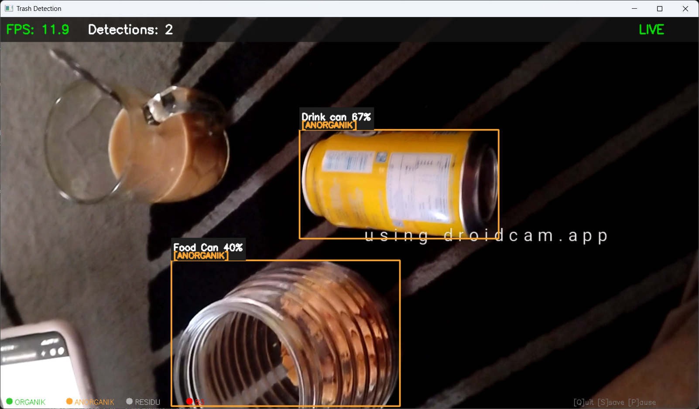

# 🗑️ Trash Classifier — AI Pemilah Sampah Real-Time

> Proyek computer vision untuk mendeteksi dan mengklasifikasikan sampah secara real-time menggunakan kamera, dengan output berupa kategori **Organik**, **Anorganik**, **Residu**, dan **B3**.

---

## 📋 Daftar Isi

- [Tentang Proyek](#-tentang-proyek)
- [Demo](#-demo)
- [Perjalanan Pengembangan](#-perjalanan-pengembangan)
- [Arsitektur Final](#-arsitektur-final)
- [Struktur Folder](#-struktur-folder)
- [Cara Pakai](#-cara-pakai)
- [Dataset](#-dataset)
- [Kategori Sampah](#-kategori-sampah)
- [Teknologi](#-teknologi)

---

## 🧠 Tentang Proyek

Proyek ini bertujuan membangun sistem klasifikasi sampah otomatis menggunakan kamera secara real-time. Sistem ini bisa membedakan jenis sampah dan menampilkan:

- **Nama spesifik objek** yang terdeteksi (contoh: *Clear plastic bottle*, *Battery*)
- **Kategori sampah** sesuai standar pemilahan (Organik / Anorganik / Residu / B3)
- **Bounding box** berwarna di sekitar objek yang terdeteksi

Target akhirnya adalah model ini bisa berjalan di **Raspberry Pi** secara offline menggunakan format **NCNN**.

---

## 🎬 Demo

```
[DETECT] Clear plastic bottle  →  ANORGANIK  (87%)
[DETECT] Battery               →  B3         (92%)
[DETECT] Food waste            →  ORGANIK    (78%)
```

**Tampilan kamera:**
```
┌─────────────────────────────┐
│  FPS: 28.3   Detections: 2  │
│ ┌──────────────────┐        │
│ │Clear plastic 87% │        │
│ │[ANORGANIK]       │        │
│ └──────────────────┘        │
│   ● ORGANIK  ● ANORGANIK    │
│   ● RESIDU   ● B3           │
└─────────────────────────────┘
```


---

## 🗓️ Perjalanan Pengembangan

Proyek ini melewati banyak iterasi sebelum mencapai bentuk sekarang. Berikut timeline lengkapnya:

---

### Versi 1 — YOLOv5n (Detection)

**Model:** YOLOv5 Nano  
**Dataset:** TrashNet (didownload otomatis via script)  
**Kelas:** `plastik`, `organik`, `lainnya`

**Hasil:**
- Model berhasil berjalan dan mendeteksi objek dengan bounding box
- Namun akurasi kurang memuaskan — bounding box sering tidak tepat
- Proses training sangat lama di CPU (menggunakan YOLOv5n yang relatif besar untuk CPU)

**Masalah:**
- Framework YOLOv5 via `torch.hub.load` tidak kompatibel dengan Python 3.13
- Dataset TrashNet memiliki kualitas anotasi yang terbatas

---

### Versi 2 — YOLOv5n + Dataset Kaggle

**Model:** YOLOv5 Nano  
**Dataset:** Kaggle Trash Dataset  
**Kelas:** `organik`, `anorganik`, `B3`

**Hasil mAP50:** ~0.814

**Masalah yang ditemukan:**
- ❌ Dataset Kaggle hanya memiliki *image-level label* (tidak ada bounding box) — sehingga model tidak bisa menunjukkan *"benda ini ada di mana"*
- ❌ Semua gambar dari folder anorganic masuk ke 1 class saja → model selalu prediksi "anorganik 98%"
- ❌ Detection box tidak muncul di kamera
- ❌ Incompatibility dengan Python 3.13

---

### Peralihan ke YOLOv8 — Classification Approach

**Model:** YOLOv8n-cls (klasifikasi gambar, bukan deteksi objek)  
**Dataset:** Dataset lokal (2 folder: `DATASETS` + `dataset-sampah`)  
**Kelas:** `organik`, `anorganik`, `residu`

**Apa yang berbeda:**
- Beralih ke YOLOv8 karena lebih cepat, modern, dan kompatibel
- Mencoba *image classification* (menilai seluruh frame) bukan *object detection* (mendeteksi per objek)

**Masalah:**
- ❌ Class imbalance parah: `anorganik` = 11.918 gambar vs `organik` = 1.000 gambar
- ❌ Model belajar "semua = anorganik" akibat ketidakseimbangan data
- ❌ Tidak ada bounding box → model menilai seluruh frame, bukan objek spesifik
- ❌ Kategori "residu" tidak jelas — manusia, tembok, furniture pun ikut terdeteksi sebagai residu

**Pelajaran:** Dataset berupa folder gambar tanpa anotasi lokasi objek = cocok untuk *klasifikasi*, bukan *deteksi*.

---

### Percobaan Dataset Roboflow

**Model:** YOLOv8n (detection)  
**Dataset:** SAMPAH.v1 dari Roboflow Universe  
**Kelas:** `BOTOL`, `DAUNKERING`, `KERTASBUNGKUS`, `KORAN`, `LOGAM FERO`, `LOGAM NONFERO`, `MIKA`, `daunbasah`

**Yang berhasil:**
- ✅ Bounding box sudah muncul
- ✅ 15.007 gambar training dengan anotasi lokasi objek
- ✅ FPS mencapai 28–30 di CPU

**Masalah:**
- ❌ Kualitas dataset kurang terpercaya — **wajah manusia terdeteksi sebagai "MIKA"**
- ❌ Kelas-kelas tidak sesuai kebutuhan (tidak ada organik/anorganik yang jelas)
- ❌ Anotasi dari komunitas Roboflow tidak selalu akurat

---

### Versi Final — YOLOv8n + TACO Dataset ✅

**Model:** YOLOv8n (detection)  
**Dataset:** [TACO (Trash Annotations in Context)](http://tacodataset.org)  
**Kelas:** 60 kelas spesifik (Battery, Clear plastic bottle, Food waste, dll)  
**Kategori output:** `ORGANIK` / `ANORGANIK` / `RESIDU` / `B3`

**Yang berhasil:**
- ✅ Bounding box akurat per objek
- ✅ Anotasi akademis (bukan crowdsourced) → lebih terpercaya
- ✅ Nama objek spesifik ditampilkan di kamera
- ✅ Mapping kategori dilakukan di inference tanpa perlu retrain
- ✅ Model diekspor ke format **NCNN** untuk Raspberry Pi

---

## 🏗️ Arsitektur Final

```
Kamera
  │
  ▼
YOLOv8n Detection (60 kelas TACO)
  │
  ├── Nama objek spesifik → tampil di bounding box
  │     contoh: "Clear plastic bottle 87%"
  │
  └── Mapping kategori (di detect_camera.py)
        "Clear plastic bottle" → ANORGANIK (🟠)
        "Food waste"           → ORGANIK   (🟢)
        "Battery"              → B3        (🔴)
        "Cigarette"            → RESIDU    (⚫)
```

---

## 📁 Struktur Folder

```
trash_classifier/
│
├── 📂 train/
│   ├── convert_taco.py    # Konversi TACO (COCO format) → YOLOv8 format
│   ├── train.py           # Training model YOLOv8
│   └── export_ncnn.py     # Export model ke format NCNN (untuk Raspberry Pi)
│
├── 📂 inference/
│   └── detect_camera.py   # Deteksi real-time via kamera
│
├── 📂 dataset/
│   └── taco_yolo/         # Dataset hasil konversi (siap training)
│
├── 📂 TACO/               # Raw TACO dataset (clone dari GitHub)
│   └── data/
│       ├── annotations.json
│       └── batch_1/ ... batch_15/
│
└── 📂 models/
    ├── trash_det_best.pt          # Model PyTorch (untuk testing di PC)
    └── trash_det_ncnn/            # Model NCNN (untuk Raspberry Pi)
        ├── model.ncnn.param
        └── model.ncnn.bin
```

---

## 🚀 Cara Pakai

### 1. Install Dependencies

```bash
pip install ultralytics opencv-python
```

### 2. Download Dataset TACO

```bash
git clone https://github.com/pedropro/TACO
cd TACO
python download.py
cd ..
```

### 3. Convert Dataset ke Format YOLOv8

```bash
python train/convert_taco.py
```

### 4. Training Model

```bash
# Quick test (2 epoch)
python train/train.py --data dataset/taco_yolo/data.yaml --epochs 2

# Full training (50 epoch, ~3-6 jam di CPU)
python train/train.py --data dataset/taco_yolo/data.yaml --epochs 50
```

### 5. Export ke NCNN (untuk Raspberry Pi)

```bash
python train/export_ncnn.py
```

### 6. Jalankan Detection Real-Time

```bash
# Kamera utama
python inference/detect_camera.py

# Kamera eksternal (DroidCam, dll)
python inference/detect_camera.py --camera 1

# Lebih cepat (imgsz kecil)
python inference/detect_camera.py --imgsz 320 --camera 1
```

**Kontrol kamera:**
| Tombol | Fungsi |
|--------|--------|
| `Q` / `ESC` | Keluar |
| `S` | Simpan screenshot |
| `P` | Pause / Resume |

---

## 📊 Dataset

| Dataset | Sumber | Jumlah Gambar | Keterangan |
|---------|--------|--------------|------------|
| TrashNet | Script otomatis | ~2.500 | Kelas terbatas, dataset awal |
| Kaggle Trash | Kaggle | ~6.000 | Image-level label, tanpa bbox |
| Dataset Lokal | Koleksi pribadi | ~13.900 | 2 folder, imbalanced |
| SAMPAH.v1 | Roboflow Universe | ~15.000 | Bbox ada, kualitas anotasi kurang |
| **TACO** *(Final)* | **tacodataset.org** | **~1.500** | **Anotasi akademis, 60 kelas, akurat** |

> **Kenapa TACO lebih baik meski gambarnya lebih sedikit?**  
> Karena anotasinya dibuat secara manual oleh peneliti, bukan crowdsourcing. Kualitas > kuantitas.

---

## 🗂️ Kategori Sampah

Model mendeteksi 60 jenis objek dari TACO, lalu memetakan ke 4 kategori:

| Kategori | Warna | Contoh Objek |
|----------|-------|-------------|
| 🟢 **ORGANIK** | Hijau | Sisa makanan |
| 🟠 **ANORGANIK** | Orange | Botol plastik, kaleng, kardus, kertas, kaca |
| ⚫ **RESIDU** | Abu-abu | Sepatu, rokok, tali, sampah tak teridentifikasi |
| 🔴 **B3** | Merah | Baterai, aerosol |

---

## 🛠️ Teknologi

| Komponen | Teknologi |
|----------|-----------|
| Model AI | [YOLOv8n](https://github.com/ultralytics/ultralytics) |
| Framework | Ultralytics + PyTorch |
| Computer Vision | OpenCV |
| Dataset | [TACO Dataset](http://tacodataset.org) |
| Export Format | NCNN (untuk Raspberry Pi) |
| Language | Python 3.13 |

---

## 📌 Catatan Deployment Raspberry Pi

File yang perlu di-copy ke Raspberry Pi:

```
models/
  └── trash_det_ncnn/
        ├── model.ncnn.param
        └── model.ncnn.bin

inference/
  └── detect_camera.py
```

Jalankan di Raspberry Pi:
```bash
pip install ultralytics opencv-python
python detect_camera.py --model models/trash_det_ncnn --imgsz 320
```

---

*Dibuat dengan ❤️ | Dataset: TACO | Model: YOLOv8n | Format Deploy: NCNN*
